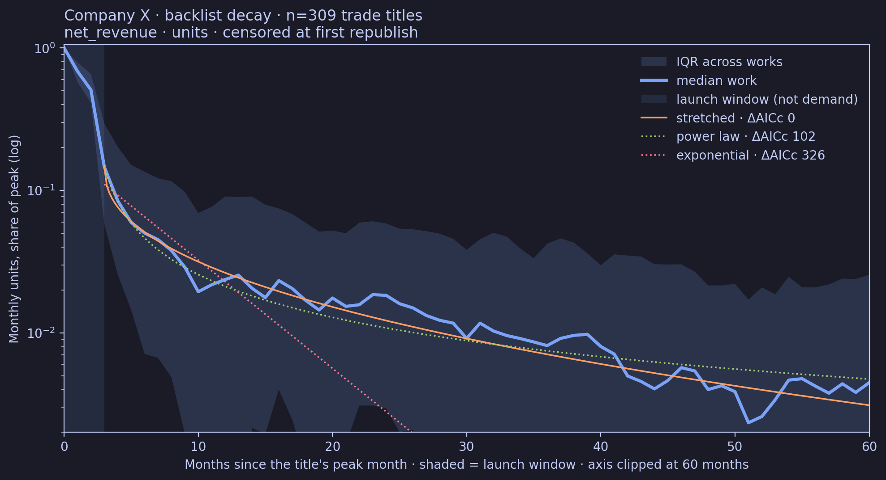
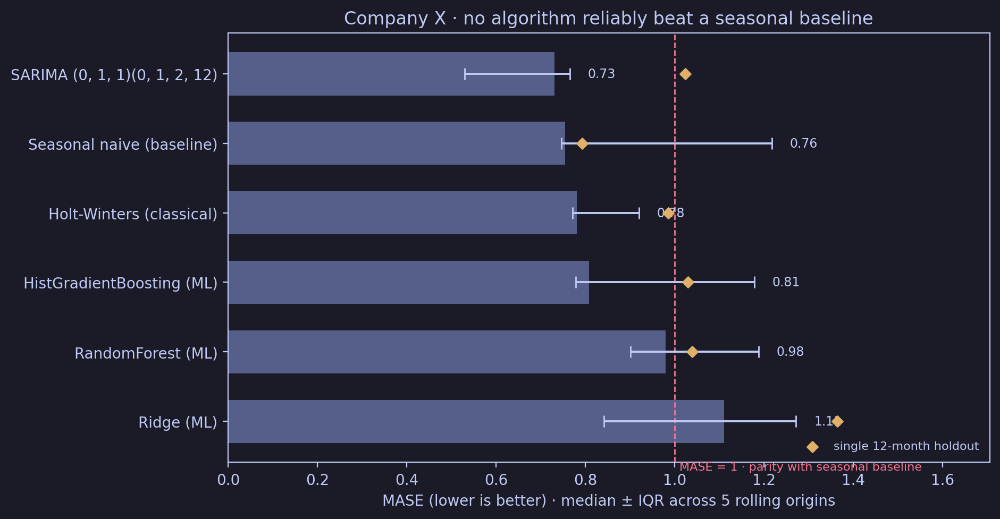
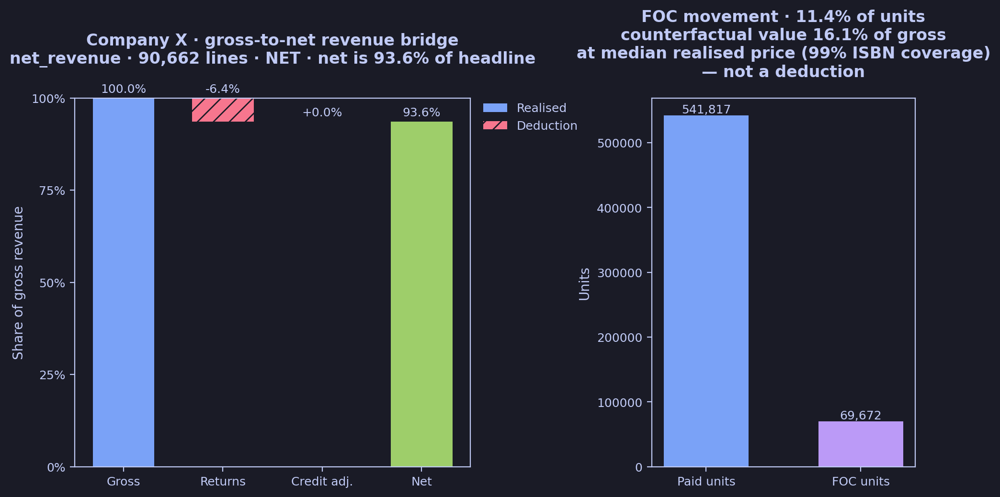

# 📚 Project 4: Books Don't Die, They Slow Down

**Time-series forecasting · Lifecycle decay modelling · Machine learning · Live client engagement**

Author: Mike Ee, [mikeee.co](https://mikeee.co) · Institute of Data capstone, August 2026

---

## Overview

A 15-year invoice register (94,872 lines, August 2011 to July 2026) from a publishing client, referred to throughout as **Company X**, is turned into a single, verified data contract and then used to answer four business questions about demand, title lifecycles and revenue exposure.

> **Public version.** These notebooks have been cleaned and re-run for public access, for portfolio viewing only. See [Dual-tier delivery](#dual-tier-delivery).

---

## Research questions

| # | Question | Notebook |
|---|---|---|
| Q1 | How has demand shifted across format, publishing arm and genre over 15 years? | 02 |
| Q2 | After a title peaks, does demand fall off a cliff or slow down? | 02, 04 |
| Q3 | How far does net revenue sit below gross, and what drives the gap? | 02 |
| Q4 | Can monthly book demand be forecast better than "same month last year"? | 03 |

---

## Key results

**Q1 · Demand mix**
- Books earn **78.2%** of gross revenue; services earn **10.6%** from only 0.2% of lines.
- Paperback carries **96%** of units over the last two years; eBooks rose from 0% to 3.9%.
- Essays are 24.6% of units but **32.6% of revenue**. Only 33 of 113 sub-category labels are needed to reach 90% of revenue.
- The top 12 of 663 customers account for **64%** of genre revenue.

**Q2 · Lifecycle**
- Backlist demand follows a **stretched exponential with β = 0.44**: the decay rate *falls* as a title ages. A constant-rate exponential loses by ΔAICc 326.
- **62%** of a typical title's post-peak units arrive after month 3, and **73%** of titles are still selling in year 5.
- The "half-life" metric was tested and demoted: it measured the smoothing window, not the book.

**Q3 · Revenue exposure**
- Net revenue is **93.6%** of gross. Returns remove 6.4%; credit adjustments net to about zero.
- Free-of-charge (FOC) copies are 11.4% of units, worth **16.1%** of gross revenue at median prices: about 2.5 times the returns leak.

**Q4 · Forecasting**
- Seasonality is moderate (strength 0.48), peaking October to December.
- **No model reliably beat the seasonal baseline.** SARIMA has the best cross-validated MASE (0.764 against 0.965) but loses on the 12-month holdout (1.023 against 0.792). The best machine-learning model (Random Forest, 0.971) does not beat the baseline.
- Six-month forecast (August 2026 to January 2027): **+77%** on the same months last year, with a wide 80% band.

| | | |
|---|---|---|
|  |  |  |

---

## How it was built

- **One data contract.** Notebook 01 defines a book line once, positively, and serialises nine filters to JSON. `capstone.py` is the only reader, so no notebook retypes a filter.
- **Four-state sign taxonomy.** `null` is a state, not an absence, so no line silently drops out of a population.
- **Leakage-safe forecasting.** Chronological split, lags of 12 months or more, `shift` before `rolling`, and expanding-window cross-validation.
- **Like-for-like evaluation.** Six models share one error scale (MASE), one holdout and one set of five rolling origins, ranked on cross-validated error with the holdout shown alongside.
- **Pre-registered decision rule** for the decay analysis, stated before any output was generated.
- **Privacy by construction.** `save_fig()` refuses any figure not labelled "Company X", and titles, descriptions and ISBNs pass through `pseudonym()` before display.

---

## Repository structure

```
├── README.md
├── capstone.py              ← shared loader: contract, populations, display aliases, save_fig
├── 01_data_contract.ipynb   ← defines a book line; writes the filter contract
├── 02_eda.ipynb             ← profiling and 13 figures (Q1–Q3)
├── 03_forecasting.ipynb     ← classical and ML forecasting, rolling-origin CV (Q4)
├── 04_decay.ipynb           ← title lifecycle curve fitting (Q2)
├── figures/                 ← all 23 figures as rendered in the notebooks
├── data/README.md           ← expected files and schema (data not included)
└── requirements.txt
```

---

## Dual-tier delivery

The engagement was delivered in two tiers from one codebase.

| | Client tier | Public tier (this repository) |
|---|---|---|
| Audience | The client, privately | Recruiters and reviewers |
| Client identity | Named | "Company X" / "the client" |
| Titles, authors, customers, ISBNs | Named | Aliased (`Title 001`, `Book A`, `Customer 01`) |
| Monetary values | True | Masked; percentages, shares and ratios unchanged |
| Data | Held in confidence | Not included |

Units, percentages and model results are the same in both tiers.

---

## Running the notebooks

The data is proprietary to the client and is not included (see [`data/README.md`](data/README.md)). With the data in place:

```bash
pip install -r requirements.txt
# run in order: 01 → 02 → 03 → 04
```

---

## References & Acknowledgements

I would like to thank Dr Chaitanya Rao, my course instructor, and Rachel Anastasi-Marais, our course teaching assistant, for their guidance throughout the capstone. My thanks also go to the client for sharing their data and business context.

- Hyndman, R. J., & Athanasopoulos, G. (2021). [*Forecasting: Principles and Practice*](https://otexts.com/fpp3/) (3rd ed.). OTexts. STL strength measures and forecast evaluation.
- Hyndman, R. J., & Koehler, A. B. (2006). [Another look at measures of forecast accuracy](https://doi.org/10.1016/j.ijforecast.2006.03.001). *International Journal of Forecasting*, 22(4), 679–688. MASE.
- Burnham, K. P., & Anderson, D. R. (2002). *Model Selection and Multimodel Inference* (2nd ed.). Springer. AICc.
- Seabold, S., & Perktold, J. (2010). [statsmodels: Econometric and statistical modeling with Python](https://www.statsmodels.org/). *Proceedings of the 9th Python in Science Conference*.
- Pedregosa, F. et al. (2011). [Scikit-learn: Machine Learning in Python](https://scikit-learn.org/stable/). *Journal of Machine Learning Research*, 12, 2825–2830.

**Libraries:** `pandas`, `numpy`, `pyarrow`, `matplotlib`, `matplotx`, `colorcet`, `squarify`, `scipy`, `scikit-learn`, `statsmodels`

###### Disclaimer
The analysis and take-aways in this repository are for educational and portfolio purposes. They do not represent the views of the client.
